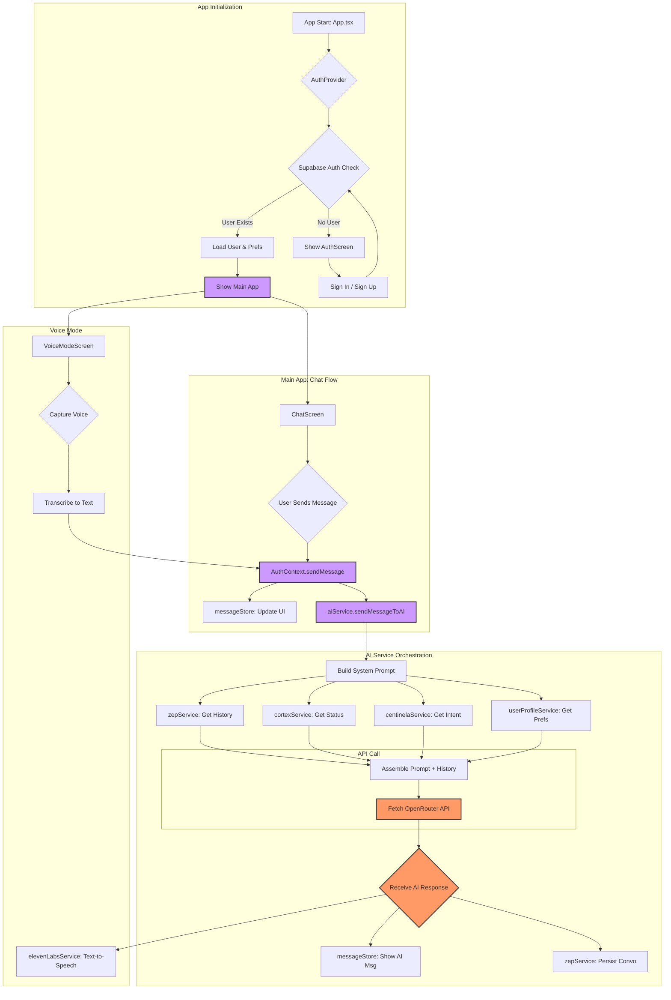

# LéNOR 2.0

LéNOR 2.0 es un asistente de IA personal y avanzado, diseñado para pensar y aprender de ti y contigo. Construido con una arquitectura moderna y robusta, LéNOR va más allá de un simple chatbot, ofreciendo una memoria persistente, personalización profunda y una experiencia de usuario fluida tanto en modo texto como en voz.

## ✨ Core Features

- **Memoria Híbrida Avanzada:** Utiliza Zep para una memoria a largo plazo semántica, permitiendo a LéNOR recordar conversaciones pasadas y aprender de ellas.
- **Personalización Profunda:** Los usuarios pueden moldear la personalidad de LéNOR y enseñarle sobre sus vidas a través de preferencias y notas en lenguaje natural.
- **Interacción Multimodal:** Soporte completo para chat de texto y un modo de voz inmersivo con transcripción y síntesis de voz en tiempo real.
- **Conciencia del Sistema:** LéNOR tiene un entendimiento de su propio estado (conexión, estado de los servicios), lo que le permite dar respuestas más inteligentes y contextuales.
- **Pre-procesamiento de Intenciones:** Un micro-servicio (`Centinela`) analiza la intención del usuario antes de la llamada principal a la IA, mejorando la precisión y eficiencia.
- **Arquitectura Robusta:** Manejo de estado centralizado, gestión de errores y una clara separación de servicios.

## 🚀 Arquitectura y Flujo de Datos

La aplicación está construida con una arquitectura cliente-servidor donde el cliente (React Native) orquesta las llamadas a varios servicios de backend para construir una experiencia de IA cohesiva.



## 🛠️ Stack Tecnológico

- **Framework:** React Native (Expo)
- **Lenguaje:** TypeScript
- **Backend & Autenticación:** Supabase (Auth, Postgres DB, Storage)
- **Modelo de IA:** Servido a través de OpenRouter (compatible con GPT-4, Llama, etc.)
- **Memoria a Largo Plazo:** Zep
- **Síntesis de Voz:** ElevenLabs
- **Gestión de Estado:** React Context API + Zusttand (en `messageStore`)
- **Navegación:** React Navigation

## ⚙️ Estructura del Proyecto

El código fuente está organizado de manera modular para facilitar el mantenimiento y la escalabilidad.

-   `src/components`: Componentes de UI reutilizables (Botones, Cards, etc.).
-   `src/screens`: Pantallas principales de la aplicación (Chat, Perfil, etc.).
-   `src/contexts`: Contextos de React para la gestión del estado global (Auth, Theme).
-   `src/services`: Lógica de negocio y comunicación con APIs (aiService, zepService, supabaseClient, etc.).
-   `src/navigation`: Configuración de la navegación de la app (Stacks y Tabs).
-   `src/theme`: Definiciones de diseño (colores, espaciado, tipografía).
-   `src/types`: Definiciones de tipos y interfaces de TypeScript.

## 🚀 Empezar

Para ejecutar el proyecto localmente, sigue estos pasos:

1.  **Clonar el repositorio:**
    ```bash
    git clone https://github.com/ernestoloe/LeNOR2.0.git
    cd LeNOR2.0
    ```

2.  **Instalar dependencias:**
    ```bash
    yarn install
    ```

3.  **Configurar variables de entorno:**
    Crea un archivo `.env` en la raíz del proyecto y añade las siguientes claves. Estas son **esenciales** para que la aplicación funcione.

    ```env
    EXPO_PUBLIC_SUPABASE_URL="TU_URL_DE_SUPABASE"
    EXPO_PUBLIC_SUPABASE_ANON_KEY="TU_ANON_KEY_DE_SUPABASE"
    EXPO_PUBLIC_OPENROUTER_API_KEY="TU_API_KEY_DE_OPENROUTER"
    EXPO_PUBLIC_ELEVENLABS_API_KEY="TU_API_KEY_DE_ELEVENLABS"
    EXPO_PUBLIC_ELEVENLABS_VOICE_ID="ID_DE_LA_VOZ_DE_ELEVENLABS"

    # Opcionales
    EXPO_PUBLIC_OPENROUTER_MODEL="openai/gpt-4.1-mini"
    EXPO_PUBLIC_AI_TEMPERATURE="0.7"
    EXPO_PUBLIC_AI_MAX_TOKENS="8000"
    ```

4.  **Iniciar el servidor de desarrollo:**
    ```bash
    yarn start
    ```

Esto iniciará el servidor de Metro. Puedes escanear el código QR con la app de Expo Go en tu dispositivo para abrir la aplicación.
